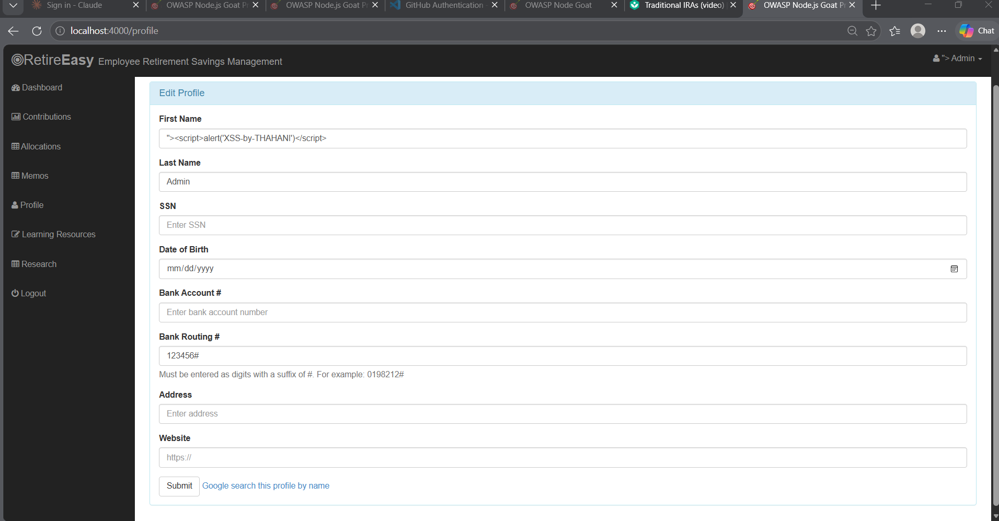
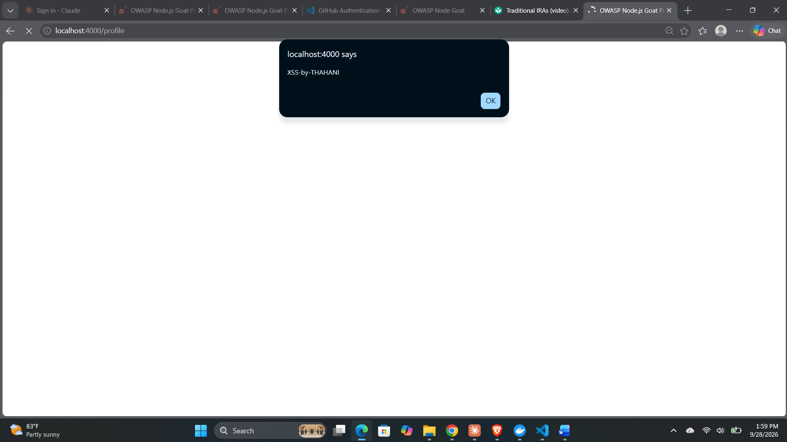
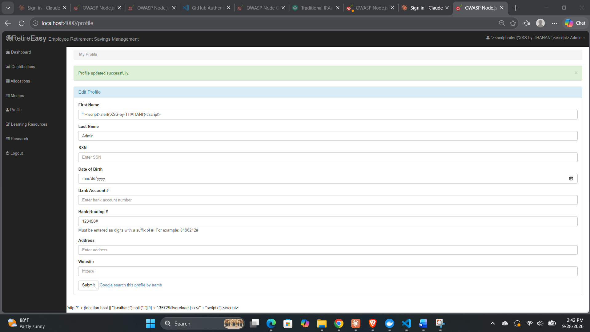

# Evidence — Secure Coding (Exploit → Fix → Re-test)

This folder holds the screenshot evidence referenced in the Technical Report.

## V3 — Stored Cross-Site Scripting (Profile) — OWASP A3

**Vulnerable file:** `app/routes/profile.js` (stored input) rendered via
`app/views/profile.html`, with Swig auto-escaping disabled in `server.js`.
**Threat reference:** `docs/02_THREAT_MODEL.md` (T3). **Fix diff:** `docs/v3_fix.diff`.

### Before — exploit works (E07a)

A script payload entered in the profile **First Name** field is stored in MongoDB
and returned to the browser unescaped, so it executes for anyone who views the
profile.

Stored payload in the profile form:



The payload executing (JavaScript `alert` firing from localhost:4000):



### The fix (E07b)

Three layers, all in `server.js` (see `docs/v3_fix.diff`):
1. Enabled Swig contextual output auto-escaping (`autoescape: true`) — the root fix.
2. Set the session cookie `httpOnly: true` — client-side JS can no longer read it.
3. Added a helmet Content-Security-Policy (report-only) limiting scripts to `'self'`.


### After — exploit blocked (E07c)

The identical payload now renders as inert, HTML-escaped text — no `alert` fires.



## DAST — OWASP ZAP baseline scan (extra credit)

A dynamic scan of the **running** application (unlike the static SAST gates), using
OWASP ZAP's baseline (passive) scan against `http://localhost:4000`.

- **Report:** `evidence/zap_report.html` (open in a browser) and `evidence/zap_report.md`.
- **CI workflow:** `.github/workflows/zap-dast.yml` — starts the app with Docker Compose
  and runs the ZAP baseline scan on every push to `main` / PR.
- **Result summary:** 1 High, 5 Medium, 8 Low, 9 Informational (49 passive checks passed).
  ZAP flags runtime issues such as missing security headers, source-code disclosure and
  session-handling — complementing the static analysis done by the other members.

How it was run locally:

```bash
docker compose up -d --build
docker run --rm --add-host=host.docker.internal:host-gateway \
  -v "$PWD/evidence:/zap/wrk:rw" zaproxy/zap-stable \
  zap-baseline.py -t http://host.docker.internal:4000 -r zap_report.html -w zap_report.md
```


